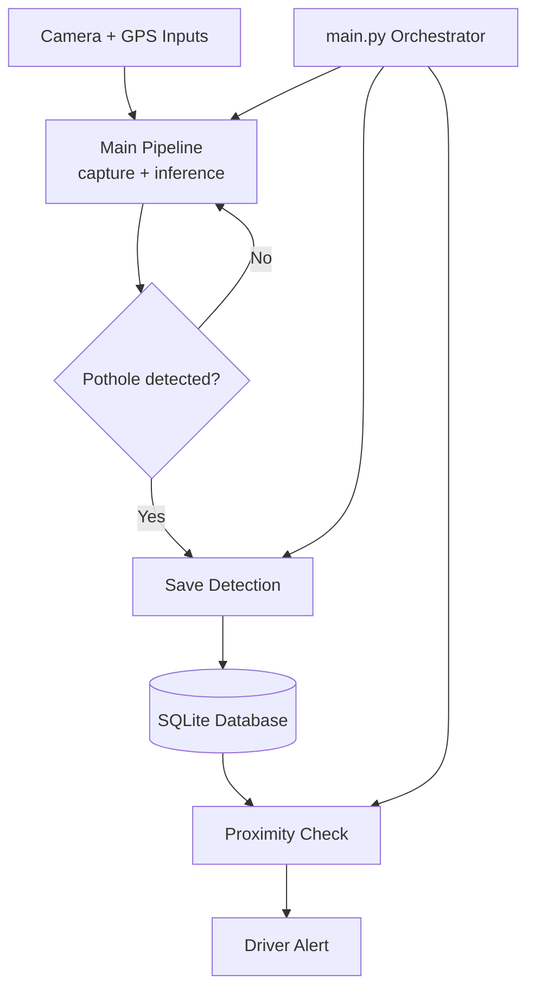

# System Architecture Diagram

```mermaid
flowchart TD
    A[Camera + GPS Inputs] --> B[Main Pipeline<br/>capture + inference]
    B --> C{Pothole detected?}
    C -- No --> B
    C -- Yes --> D[Save Detection]
    D --> E[(SQLite Database)]
    E --> F[Proximity Check]
    F --> G[Driver Alert]
    H[main.py Orchestrator] --> B
    H --> D
    H --> F
```

